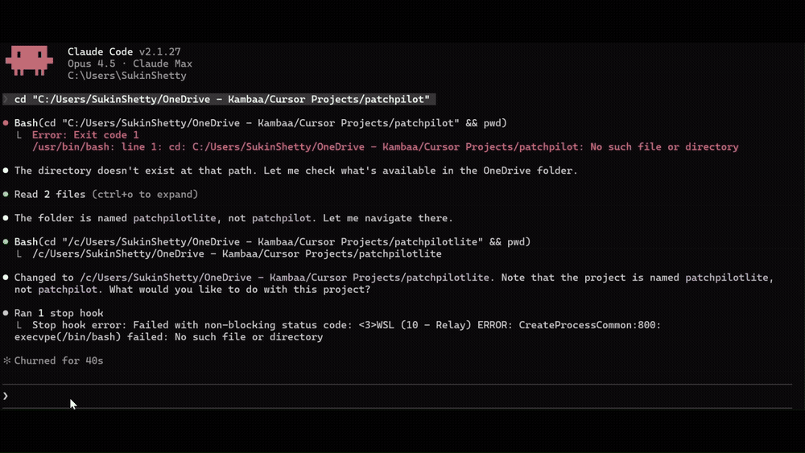
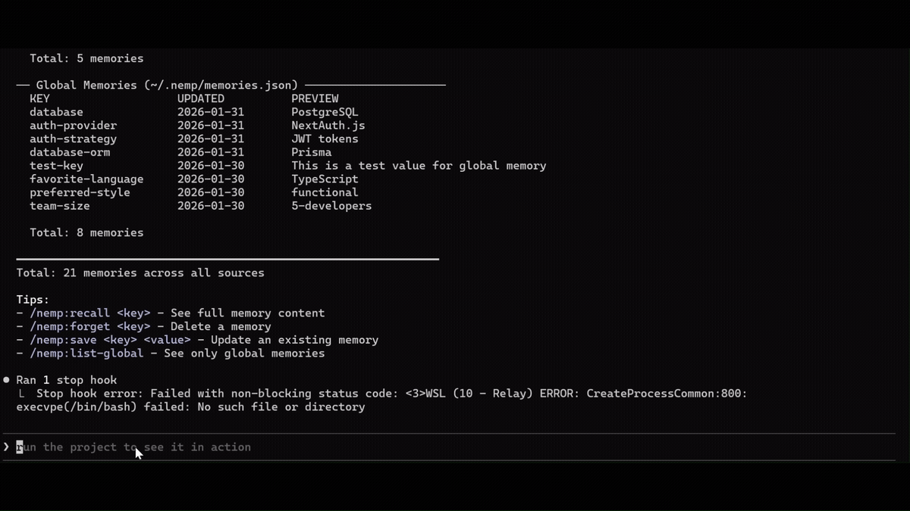
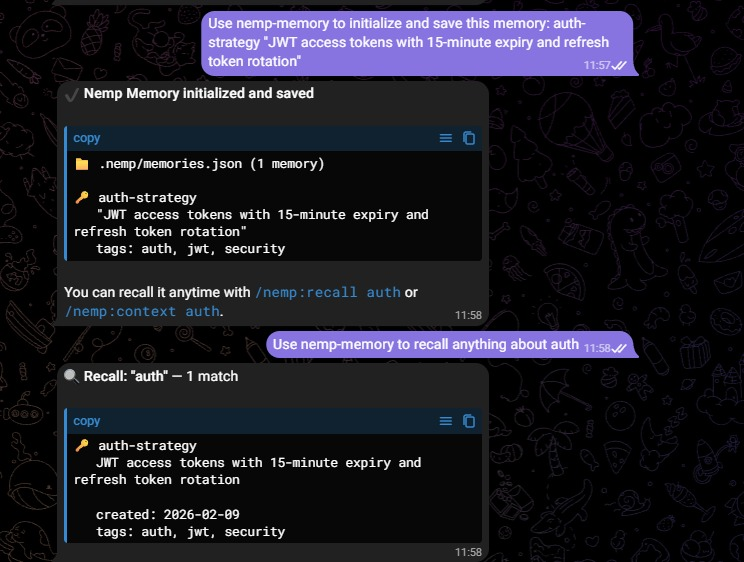

<div align="center">

  <table border="0" cellspacing="0" cellpadding="0">
    <tr>
      <td></td>
      <td><h1>&nbsp;Nemp Memory</h1></td>
    </tr>
  </table>

  <p><strong>Local project memory for Claude Code and OpenClaw.</strong></p>
  <p>Save a decision once. Every new session starts knowing your stack, your rules and why things are the way they are.</p>

  <p>
    
    
    
    
    <a href="LICENSE"></a>
    <a href="https://openclaw.ai"></a>
  </p>

  

</div>

---

## Why Nemp

Claude Code starts every session from zero. You end up re-explaining the same things:

- your stack and project structure
- decisions you already made, and why
- conventions, preferences and known gotchas
- what you were working on yesterday

Nemp keeps that context in plain JSON inside your project, lets you search it, and keeps your `CLAUDE.md` in step with it. No servers, no database, no API keys, no dependencies.

---

## Quick start

```bash
# 1. Install
/plugin marketplace add https://github.com/SukinShetty/Nemp-memory
/plugin install nemp

# 2. Let Nemp learn your stack
/nemp:init

# 3. Save something worth remembering
/nemp:save api-style "REST, not GraphQL - team decision Jan 2026"

# 4. Keep CLAUDE.md up to date automatically
/nemp:auto-sync on
```

That's it. Next session, find anything with `/nemp:context <topic>`.

Windows or marketplace trouble? See [other install methods](#installation) and [Troubleshooting](docs/TROUBLESHOOTING.md).

---

## What you get

### 1. One-command project setup

<p align="center">
  
</p>

`/nemp:init` reads your `package.json` and saves your framework, language, database and ORM, auth, styling and package manager as memories in one go.

```
Framework:       Next.js 14 (App Router)
Language:        TypeScript (strict)
Database:        PostgreSQL via Prisma
Auth:            NextAuth.js
Styling:         Tailwind CSS
Package manager: npm

Saved 6 memories.
```

### 2. Compact, typed memories

`/nemp:save <key> <value>` stores a memory with:

- **Compression** - filler is stripped and values kept short, with technical terms, paths and versions left exactly as written.
- **A type** - `fact`, `rule`, `decision`, `preference`, `goal`, `warning` and more, inferred from the key and value (or set with `--type`).
- **Attribution** - which agent wrote it (`main`, `nemp-init`, `backend`...), so multi-agent projects stay traceable.
- **A conflict hint** - if a related key already says something different, Nemp warns you when you save.

### 3. Context search that expands your query

<p align="center">
  
</p>

`/nemp:context auth` doesn't just look for "auth". It expands to related terms - authentication, login, session, jwt, oauth, token, nextauth, clerk - and searches keys and values across project and global memory.

```
FOUND 3 MEMORIES MATCHING "auth"

auth-provider    NextAuth.js with JWT strategy
auth-tokens      15min access tokens, 7-day refresh
auth-middleware  Protects /api routes except /auth/*
```

Search is keyword-based with a built-in synonym map. It runs locally and needs no embeddings or model downloads.

### 4. CLAUDE.md that stays current

| Command | What it does |
|---|---|
| `/nemp:export` | Writes a "Project Context" section into `CLAUDE.md` from your memories |
| `/nemp:auto-sync on` | Rewrites that section every time you save, forget or init |
| `/nemp:sync` | Imports notes you wrote by hand in `CLAUDE.md`, and flags where `CLAUDE.md` disagrees with your project files |

Your own rules at the top of `CLAUDE.md` are never touched. Nemp only manages its own section.

### 5. Suggestions from your work

<p align="center">
  
</p>

`/nemp:suggest` reads your activity log (files you keep editing, packages you install, commands you repeat) and drafts memories for you to save, edit or skip. Nothing is saved without your say-so unless you use `--auto`.

Activity capture is opt-in with `/nemp:auto-capture on` and is still experimental.

### 6. Audit trail and health check

- Every read, write and delete is logged to `.nemp/access.log`. View it with `/nemp:log`, filter by agent, or tail recent entries.
- `/nemp:health` checks the store: valid JSON, empty or oversized values, duplicate keys, stale `CLAUDE.md` or `MEMORY.md`, and gives a score out of 80.

### 7. Global memory

Preferences that follow you across projects - "prefers Bun", "always use strict TypeScript" - go in `~/.nemp/` with `/nemp:save-global`. Project memory wins when both have an answer.

---

## Commands

| Area | Command | What it does |
|---|---|---|
| Setup | `/nemp:init` | Detect the project stack and save it |
| Memory | `/nemp:save <key> <value>` | Save or update a memory |
| | `/nemp:recall <key-or-query>` | Get one memory, or search |
| | `/nemp:context <topic>` | Search with keyword expansion |
| | `/nemp:list` | List all project memories |
| | `/nemp:forget <key>` | Delete a memory (asks first) |
| Global | `/nemp:save-global`, `/nemp:recall-global`, `/nemp:list-global` | Memory shared across projects |
| CLAUDE.md | `/nemp:export [--replace]` | Write memories into CLAUDE.md |
| | `/nemp:auto-sync on\|off` | Keep CLAUDE.md in sync on every change |
| | `/nemp:sync` | Two-way sync with CLAUDE.md |
| Suggestions | `/nemp:suggest [--auto]` | Draft memories from recent activity |
| | `/nemp:auto-capture on\|off` | Turn activity capture on or off (experimental) |
| | `/nemp:activity` | View captured activity |
| Audit | `/nemp:log [--tail N \| --agent <name>]` | View the access log |
| | `/nemp:health` | Check the memory store |

---

## How it works

Nemp is a set of Claude Code slash commands and one skill. When you run a command, Claude follows its instructions to read and write small files in your project. There is no background process, server or database.

```
.nemp/
  memories.json   # project memories
  access.log      # read / write / delete audit trail
  config.json     # settings such as auto-sync
  MEMORY.md       # human-readable index of memories

~/.nemp/
  memories.json   # global memories
```

A memory is plain, readable JSON:

```json
{
  "key": "auth-provider",
  "value": "NextAuth.js with JWT",
  "type": "decision",
  "tags": ["auth"],
  "agent_id": "nemp-init",
  "created": "2026-01-31T12:00:00Z",
  "updated": "2026-02-11T14:00:00Z"
}
```

You own the files. Commit them to share context with your team, or add `.nemp/` to `.gitignore` to keep it personal. Delete everything with `rm -rf .nemp`.

---

## Nemp vs. CLAUDE.md alone

| | CLAUDE.md alone | With Nemp |
|---|---|---|
| Stack captured | You write it | `/nemp:init` detects it |
| Adding a decision | Edit the file by hand | `/nemp:save`, compressed and typed |
| Finding something | Scroll or grep | `/nemp:context` with related terms |
| Keeping it current | Remember to update | Auto-sync on every change |
| Drift from real config | Unnoticed | `/nemp:sync` flags mismatches |
| Who changed what | Git blame at best | Agent attribution and access log |
| Works across projects | No | Global memory |

---

## Installation

### Plugin marketplace (recommended)

```bash
/plugin marketplace add https://github.com/SukinShetty/Nemp-memory
/plugin install nemp
```

### Windows, if the marketplace command fails

```bash
/plugin marketplace add https://github.com/SukinShetty/Nemp-memory.git
/plugin install nemp
```

### Manual install

```bash
cd ~/.claude/plugins/marketplaces
git clone https://github.com/SukinShetty/Nemp-memory.git nemp-memory
# restart Claude Code, then:
/plugin install nemp
```

Check it worked with `/nemp:list` - you should see your memories or "No memories saved yet".

Problems? [Troubleshooting](docs/TROUBLESHOOTING.md) covers EPERM errors on Windows, commands not showing up, clone failures and clean reinstalls.

### OpenClaw

Nemp also runs as an OpenClaw skill, using the same `.nemp/memories.json`.

<p align="center">
  
</p>

```bash
git clone https://github.com/SukinShetty/Nemp-memory.git ~/.openclaw/workspace/skills/nemp-memory
```

On Windows the path is `C:\Users\<you>\.openclaw\workspace\skills\nemp-memory`. The repo includes the root `SKILL.md` OpenClaw needs. Restart OpenClaw and check that `nemp-memory` appears in your skills.

Save in Claude Code, recall in OpenClaw, and the other way round. OpenClaw uses the same [AgentSkills](https://agentskills.io) standard, and Nemp only needs an agent that can read and write files.

---

## Use cases

**Onboarding.** A new developer runs `/nemp:init` on day one and Claude already knows the stack, database, auth approach and structure.

**Switching projects.** `/nemp:recall stack` in `~/client-a` says "Next.js, Stripe, PostgreSQL"; in `~/client-b` it says "React, Supabase, Tailwind". Each project remembers itself.

**Decision history.** Save "REST, not GraphQL - team decision Jan 2026" today. Three months later `/nemp:context api` finds it, with no Slack archaeology.

---

## Privacy

Everything stays on your machine. Nemp makes no network calls, sends no telemetry and needs no account. Your memories are files in your project and your home folder, readable in any editor.

---

## Nemp Pro (coming soon)

Nemp Pro is in development and adds a memory intelligence layer on top of the free plugin, including cross-tool export and import for Codex CLI, Cursor and Windsurf. The Pro commands in this repo (`/nemp:cortex`, `/nemp:foresight`, `/nemp:decay`, `/nemp:import`) currently show a notice only. Follow the repo or [nemp.dev](https://nemp.dev) for launch news.

---

## Roadmap

- More stack detection beyond `package.json` (Python, Go, Rust)
- Svelte and Angular detection
- More reliable activity capture
- Cleaner skill instructions for AgentSkills-compatible agents

Ideas welcome in [Issues](https://github.com/SukinShetty/Nemp-memory/issues).

---

## Contributing

Framework detection, keyword mappings and suggestion rules are the easiest places to start. See [CONTRIBUTING.md](CONTRIBUTING.md).

## Support

- [GitHub Issues](https://github.com/SukinShetty/Nemp-memory/issues) for bugs and requests
- Email: [contact@nemp.dev](mailto:contact@nemp.dev)
- X: [@sukin_s](https://x.com/sukin_s) - share how you use it with #NempMemory

If Nemp saves you time, a star helps other developers find it.

## License

MIT © 2026 [Sukin Shetty](https://github.com/SukinShetty). Free and open source.

---

<div align="center">
  <p>Built by <a href="https://www.linkedin.com/in/sukinshetty-1984/">Sukin Shetty</a> ·
  <a href="https://x.com/sukin_s">X</a> ·
  <a href="mailto:contact@nemp.dev">contact@nemp.dev</a></p>
  <p><strong>Stop repeating yourself. Start coding faster.</strong></p>
</div>
