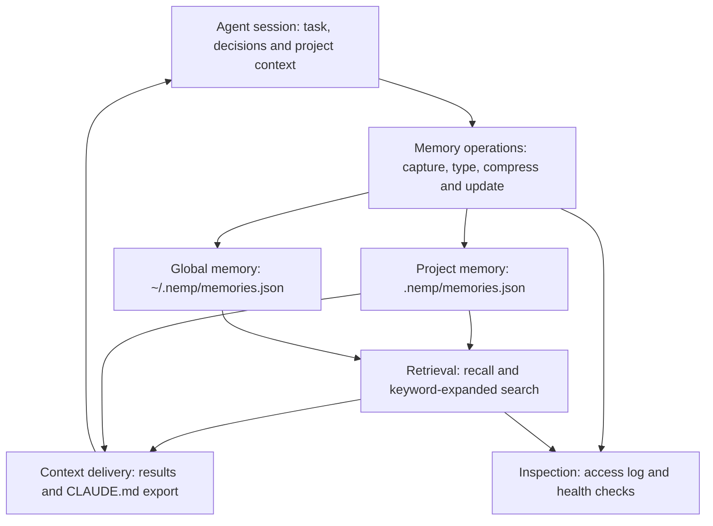
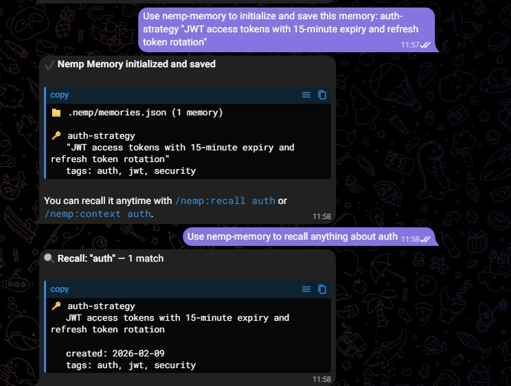

<div align="center">

  <table border="0" cellspacing="0" cellpadding="0">
    <tr>
      <td></td>
      <td><h1>&nbsp;Nemp Memory</h1></td>
    </tr>
  </table>

  <p><strong>A local-first agentic memory architecture.</strong></p>
  <p>Give AI agents durable context: project knowledge, decisions, rules and preferences that persist across sessions.</p>

  <p>
    
    
    
    
    <a href="LICENSE"></a>
    <a href="https://openclaw.ai"></a>
  </p>

  

</div>

---

## Memory for agents that work across sessions

An agent's context window covers the current task. A project carries decisions, constraints and lessons that need to outlive it.

Nemp gives that knowledge a persistent home. It organizes memory in local JSON, retrieves relevant context, records which agent wrote it, and connects it to the instructions an agent uses while working. The memory belongs to the project and the user.

The architecture has three parts: **a durable memory store, agent-executed memory operations, and integrations that bring context into a working session.** Claude Code provides the current command interface; the underlying files remain readable by other agents and tools.

[Architecture](#architecture) · [Memory lifecycle](#memory-lifecycle) · [Integrations](#integrations) · [Quick start](#quick-start) · [Commands](#commands)

---

## Architecture

Nemp runs through instructions that the host agent follows to read and write files. The current implementation is Markdown command definitions and a memory skill, with no separate memory server or background runtime.


```mermaid
flowchart TD
    A["Agent session: task, decisions and project context"]
    B["Memory operations: capture, type, compress and update"]
    C["Project memory: .nemp/memories.json"]
    D["Global memory: ~/.nemp/memories.json"]
    E["Retrieval: recall and keyword-expanded search"]
    F["Context delivery: results and CLAUDE.md export"]
    G["Inspection: access log and health checks"]

    A --> B
    B --> C
    B --> D
    C --> E
    D --> E
    E --> F
    C --> F
    F --> A
    B --> G
    E --> G
```

| Layer | Responsibility | Current implementation |
|---|---|---|
| Storage | Keep knowledge beyond a single session | Project and global JSON files |
| Memory operations | Capture and maintain useful records | Save, update, forget, compression, type inference and conflict hints |
| Retrieval | Find context for the task at hand | Key lookup and keyword search with synonym expansion |
| Context delivery | Make stored knowledge available during work | Recall results and a managed `CLAUDE.md` section |
| Observability | Inspect memory activity and integrity | Agent attribution, access logs and health checks |
| Integrations | Connect the memory workflow to a host agent | Claude Code commands and skill; OpenClaw skill entry point |

### Storage model

```text
.nemp/
  memories.json   # project knowledge and decisions
  access.log      # memory operation audit trail
  config.json     # settings such as auto-sync
  MEMORY.md       # human-readable memory index

~/.nemp/
  memories.json   # preferences and knowledge shared across projects
```

A memory carries a key and value plus metadata. This simplified entry illustrates the core fields; save operations also initialize confidence, vitality and relationship metadata.

```json
{
  "key": "auth-provider",
  "value": "NextAuth.js with JWT",
  "type": "decision",
  "tags": ["auth"],
  "agent_id": "nemp-init",
  "created": "2026-01-31T12:00:00Z",
  "updated": "2026-02-11T14:00:00Z"
}
```

Project memory holds the stack, constraints and decisions for one codebase. Global memory holds preferences that apply across projects. You control the files: inspect them in an editor, version them with your project, or keep `.nemp/` in `.gitignore`.

### Memory lifecycle

1. **Capture** project facts, explicit decisions and user preferences through initialization or save commands.
2. **Structure** each entry with a descriptive key, compact value, type and agent attribution.
3. **Persist** it in the appropriate project or global store.
4. **Retrieve** relevant entries when a task needs context, using key lookup or expanded keywords.
5. **Apply** the retrieved context in the session, or export project memory into the managed `CLAUDE.md` section.
6. **Maintain** the store through updates, deletion, conflict hints and health checks.

The host agent performs these steps when it follows Nemp's commands or skill instructions. Automation depends on that integration and its settings. Shared files and agent IDs support handoffs; coordinated concurrent writes require additional care because the current store has no transactional locking.

---

## Integrations

The storage is plain JSON. Each host still needs instructions for reading, updating and using it; a portable file format does not automatically provide a native integration.

| Agent or tool | Current status | How it connects |
|---|---|---|
| Claude Code | Packaged command and skill integration | `/nemp:*` commands, project/global memory and `CLAUDE.md` synchronization |
| OpenClaw | Skill entry point included | Root `SKILL.md`; see [OpenClaw setup](#openclaw) |
| Codex CLI, Cursor, Windsurf | Pro export instruction files exist; broader integration is in development | See [Nemp Pro and the architecture roadmap](#nemp-pro-and-the-architecture-roadmap) |
| Other file-capable agents | Manual adaptation | Read the memory files and adapt the [memory skill](skills/nemp-memory/SKILL.md) and [command instructions](commands) to the host |

For two agents to share project memory, point them at the same project store or explicitly transfer those files. Local storage does not provide automatic synchronization between machines.

---

## Quick start

Start with the Claude Code integration to use the memory lifecycle through slash commands.

```text
# 1. Install
/plugin marketplace add https://github.com/SukinShetty/Nemp-memory
/plugin install nemp

# 2. Let Nemp learn your stack
/nemp:init

# 3. Save something worth remembering
/nemp:save api-style "REST, not GraphQL - team decision Jan 2026"

# 4. Keep CLAUDE.md up to date automatically
/nemp:auto-sync on
```

In a later session, retrieve relevant memory with `/nemp:context <topic>`.

Windows or marketplace trouble? See [other install methods](#installation) and [Troubleshooting](docs/TROUBLESHOOTING.md).

---

## Core memory capabilities

### 1. Capture project knowledge

<p align="center">
  
</p>

`/nemp:init` reads your `package.json` and saves your framework, language, database and ORM, auth, styling and package manager as memories in one go.

```
Framework:       Next.js 14 (App Router)
Language:        TypeScript (strict)
Database:        PostgreSQL via Prisma
Auth:            NextAuth.js
Styling:         Tailwind CSS
Package manager: npm

Saved 6 memories.
```

### 2. Structure durable knowledge

`/nemp:save <key> <value>` stores a memory with:

- **Compression** - filler is stripped and values kept short, with technical terms, paths and versions left exactly as written.
- **A type** - `fact`, `rule`, `decision`, `preference`, `goal`, `warning` and more, inferred from the key and value (or set with `--type`).
- **Attribution** - which agent wrote it (`main`, `nemp-init`, `backend`...), so multi-agent projects stay traceable.
- **A conflict hint** - if a related key already says something different, Nemp warns you when you save.

### 3. Retrieve relevant context

<p align="center">
  
</p>

`/nemp:context auth` doesn't just look for "auth". It expands to related terms - authentication, login, session, jwt, oauth, token, nextauth, clerk - and searches keys and values across project and global memory.

```
FOUND 3 MEMORIES MATCHING "auth"

auth-provider    NextAuth.js with JWT strategy
auth-tokens      15min access tokens, 7-day refresh
auth-middleware  Protects /api routes except /auth/*
```

Search is keyword-based with a built-in synonym map. It runs locally and needs no embeddings or model downloads.

### 4. Deliver context to the agent

In the Claude Code integration, Nemp connects the memory store to a managed section of `CLAUDE.md`:

| Command | What it does |
|---|---|
| `/nemp:export` | Writes a "Project Context" section into `CLAUDE.md` from your memories |
| `/nemp:auto-sync on` | Rewrites that section every time you save, forget or init |
| `/nemp:sync` | Imports notes you wrote by hand in `CLAUDE.md`, and flags where `CLAUDE.md` disagrees with your project files |

Your own rules at the top of `CLAUDE.md` are never touched. Nemp only manages its own section.

### 5. Suggest memories from activity

<p align="center">
  
</p>

`/nemp:suggest` reads your activity log (files you keep editing, packages you install, commands you repeat) and drafts memories for you to save, edit or skip. Nothing is saved without your say-so unless you use `--auto`.

Activity capture is opt-in with `/nemp:auto-capture on` and is still experimental.

### 6. Inspect activity and memory health

- Memory instructions include logging reads, writes and deletes to `.nemp/access.log`. View it with `/nemp:log`, filter by agent, or tail recent entries. Direct edits outside those workflows are not automatically logged.
- `/nemp:health` checks the store: valid JSON, empty or oversized values, duplicate keys, stale `CLAUDE.md` or `MEMORY.md`, and gives a score out of 80.

### 7. Carry preferences across projects

Preferences that follow you across projects - "prefers Bun", "always use strict TypeScript" - go in `~/.nemp/` with `/nemp:save-global`. Keep project-specific decisions in the project store and general preferences in the global store.

---

## Commands

The following commands use the Claude Code integration's syntax.

| Area | Command | What it does |
|---|---|---|
| Setup | `/nemp:init` | Detect the project stack and save it |
| Memory | `/nemp:save <key> <value>` | Save or update a memory |
| | `/nemp:recall <key-or-query>` | Get one memory, or search |
| | `/nemp:context <topic>` | Search with keyword expansion |
| | `/nemp:list` | List all project memories |
| | `/nemp:forget <key>` | Delete a memory (asks first) |
| Global | `/nemp:save-global`, `/nemp:recall-global`, `/nemp:list-global` | Memory shared across projects |
| CLAUDE.md | `/nemp:export [--replace]` | Write memories into CLAUDE.md |
| | `/nemp:auto-sync on\|off` | Keep CLAUDE.md in sync on every change |
| | `/nemp:sync` | Two-way sync with CLAUDE.md |
| Suggestions | `/nemp:suggest [--auto]` | Draft memories from recent activity |
| | `/nemp:auto-capture on\|off` | Turn activity capture on or off (experimental) |
| | `/nemp:activity` | View captured activity |
| Audit | `/nemp:log [--tail N \| --agent <name>]` | View the access log |
| | `/nemp:health` | Check the memory store |

---

## How Nemp complements instruction files

Instruction files tell an agent how to work. Nemp adds a workflow for maintaining and retrieving the knowledge that work produces.

| Need | Instruction files maintained by hand | With Nemp's memory workflow |
|---|---|---|
| Capture the stack | Write and update it yourself | Initialize memories from project configuration |
| Preserve a decision | Add prose to the file | Save a compact, typed entry |
| Find task context | Read or search the document | Retrieve matching memories with related terms |
| Track authorship | Inspect version history | Store agent attribution and operation logs |
| Keep context current | Edit instructions after changes | Sync a managed section in the Claude Code integration |
| Reuse preferences | Copy them between projects | Keep a separate global memory store |

---

## Installation

### Claude Code marketplace

```bash
/plugin marketplace add https://github.com/SukinShetty/Nemp-memory
/plugin install nemp
```

### Claude Code on Windows

```bash
/plugin marketplace add https://github.com/SukinShetty/Nemp-memory.git
/plugin install nemp
```

### Manual Claude Code install

```bash
cd ~/.claude/plugins/marketplaces
git clone https://github.com/SukinShetty/Nemp-memory.git nemp-memory
# restart Claude Code, then:
/plugin install nemp
```

Check it worked with `/nemp:list` - you should see your memories or "No memories saved yet".

Problems? [Troubleshooting](docs/TROUBLESHOOTING.md) covers EPERM errors on Windows, commands not showing up, clone failures and clean reinstalls.

### OpenClaw

The repository includes a root `SKILL.md` entry point for OpenClaw. Its metadata identifies Nemp as a local memory skill; the detailed memory workflow is in [skills/nemp-memory/SKILL.md](skills/nemp-memory/SKILL.md) and the [command definitions](commands).

<p align="center">
  
</p>

```bash
git clone https://github.com/SukinShetty/Nemp-memory.git ~/.openclaw/workspace/skills/nemp-memory
```

On Windows the path is `C:\Users\<you>\.openclaw\workspace\skills\nemp-memory`. The repo includes the root `SKILL.md` OpenClaw needs. Restart OpenClaw and check that `nemp-memory` appears in your skills.

For shared memory, configure the agent to use the same project's `.nemp/memories.json` and follow the memory instructions. Check that it can read and save an entry in that location; slash-command availability and automation depend on the host.

---

## Use cases

**Session continuity.** Save an architecture decision today and retrieve its rationale when work resumes next week.

**Agent handoffs.** Leave project constraints and decisions in a shared store so the next agent can pick up the relevant context. Agent attribution records who wrote each entry.

**Project onboarding.** Capture the stack once, then give later sessions a starting point for understanding the codebase.

**Personal working preferences.** Keep general conventions in global memory while each project retains its own technical choices.

---

## Privacy

The core memory workflow stores data in your project and home folder and requires no hosted memory service or separate memory API key. The files are readable in any editor. When an agent reads those memories, its own model provider and data-handling settings still apply.

---

## Nemp Pro and the architecture roadmap

The current foundation is persistent storage, typed records, local retrieval and agent-facing context delivery. Nemp Pro is in development to extend this foundation with memory intelligence and cross-tool workflows.

| Area | Repository status |
|---|---|
| Confidence, vitality and relationship metadata | Save instructions initialize these fields; retrieval instructions update usage counters |
| Cortex, foresight, decay and import | The corresponding commands currently display Pro notices |
| Export to Codex CLI, Cursor and Windsurf | [Pro export instructions](commands/nemp-pro-export.md) and [auto-export configuration instructions](commands/auto-export.md) are present; these are not a standalone cross-tool runtime |
| Advanced memory intelligence | Described in the [Cortex design specification](nemp-cortex-complete-spec.md); the specification is broader than the current working commands |

The presence of metadata fields and design specifications does not mean every planned intelligence feature is operational. Follow the repository or [nemp.dev](https://nemp.dev) for release updates.

Further work includes:

- Broader stack detection beyond `package.json` (Python, Go, Rust)
- Svelte and Angular detection
- More reliable activity capture
- Clearer, portable skill instructions for additional agent hosts

Ideas welcome in [Issues](https://github.com/SukinShetty/Nemp-memory/issues).

---

## Contributing

Framework detection, keyword mappings and suggestion rules are the easiest places to start. See [CONTRIBUTING.md](CONTRIBUTING.md).

## Support

- [GitHub Issues](https://github.com/SukinShetty/Nemp-memory/issues) for bugs and requests
- Email: [contact@nemp.dev](mailto:contact@nemp.dev)
- X: [@sukin_s](https://x.com/sukin_s) - share how you use it with #NempMemory

If Nemp saves you time, a star helps other developers find it.

## License

MIT © 2026 [Sukin Shetty](https://github.com/SukinShetty). Free and open source.

---

<div align="center">
  <p>Built by <a href="https://www.linkedin.com/in/sukinshetty-1984/">Sukin Shetty</a> ·
  <a href="https://x.com/sukin_s">X</a> ·
  <a href="mailto:contact@nemp.dev">contact@nemp.dev</a></p>
  <p><strong>Give every session a memory to build on.</strong></p>
</div>
