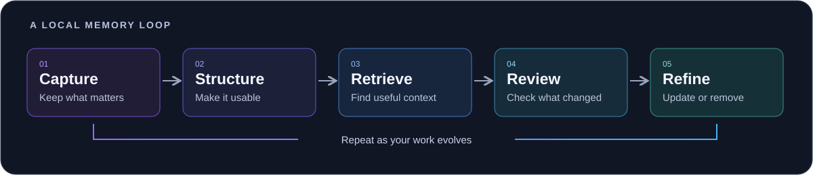
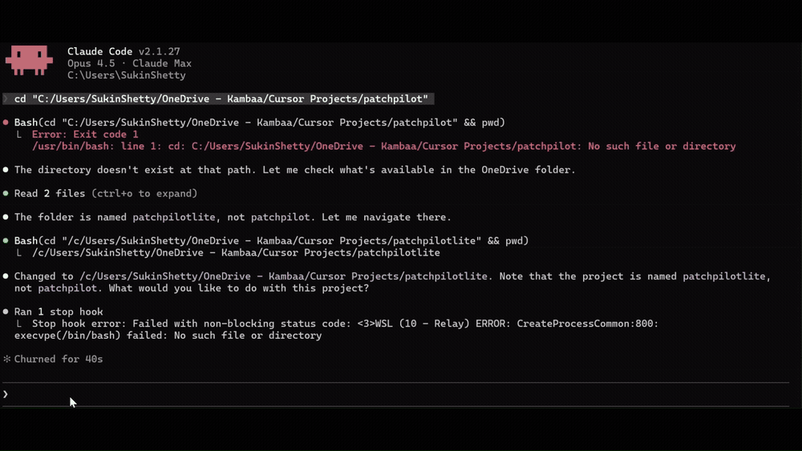
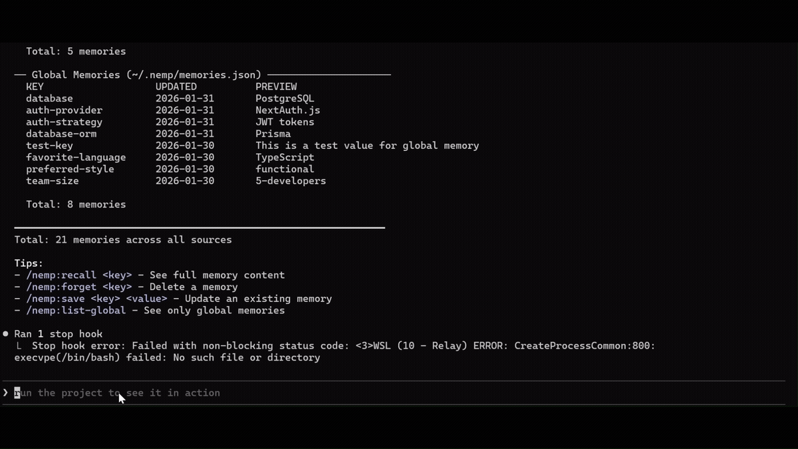

<div align="center">
  
  <h1>Nemp</h1>
  <p><strong>Agentic memory that evolves with your work</strong></p>
  <p>Keep the decisions, preferences and context your next session needs.<br />Capture what matters. Find it again. Refine it as your work changes.</p>
  <p>
    <a href=".claude-plugin/plugin.json"></a>
    <a href="docs/PRIVACY.md"></a>
    <a href="LICENSE"></a>
  </p>
  <p><a href="#start-with-one-useful-memory">Get started</a> · <a href="docs/COMMANDS.md">Commands</a> · <a href="docs/ARCHITECTURE.md">How it works</a> · <a href="docs/ROADMAP.md">Roadmap</a></p>
</div>

## Your work moves forward. Your memory should too.

A decision changes. A workaround becomes a rule. Yesterday's assumption stops being true. The next agent session needs the context you still trust, not another copy of an old conversation.

Nemp gives that context a home in local, editable files. Save a decision, retrieve it in a later session, and update the same memory when the project changes. Keep project knowledge in `.nemp/` and reusable preferences in `~/.nemp/`.

**Nemp Open v0.3.0** is the free, MIT-licensed foundation: agent-guided commands, keyword-based retrieval and `CLAUDE.md` sync through the Claude Code integration. The host agent follows Nemp's instructions; Nemp is not a separate background intelligence service.

## Start with one useful memory

Run these inside **Claude Code**, from your project directory:

```text
/plugin marketplace add https://github.com/SukinShetty/Nemp-memory
/plugin install nemp@nemp-memory
```

Restart Claude Code if the new commands aren't available, then:

```text
/nemp:save api-style "Use REST for the public API; keep GraphQL internal"
/nemp:recall api-style
```

When the decision changes, save the same key again:

```text
/nemp:save api-style "Use REST for all APIs; GraphQL retired after the migration"
```

That is the core loop: **save useful context, use it, keep it current**.

Want a head start? `/nemp:init` detects a JavaScript or TypeScript stack from `package.json`. `/nemp:auto-sync on` enables `CLAUDE.md` updates after supported memory changes. [Full setup guide →](docs/GETTING_STARTED.md)

## A memory you can work with

<p align="center">
  
</p>

| Step | What you do | In Nemp Open |
| :--- | :--- | :--- |
| **Capture** | Keep a decision, convention or useful fact | `/nemp:save` or `/nemp:init` |
| **Structure** | Give it a clear key, concise value and type | Save instructions add metadata and agent attribution |
| **Retrieve** | Find the context for your next task | `/nemp:recall` and `/nemp:context` |
| **Review** | Check what is saved and what needs attention | `/nemp:list`, `/nemp:health`, `/nemp:sync` |
| **Refine** | Update a changed decision or remove obsolete context | Save the same key again, or `/nemp:forget` |

“Evolves” means memory can change alongside the work. Today, this loop is agent-guided and user-directed. Automatic learning, validated corrections and reversible archival are [future work](docs/ROADMAP.md).

### Built for the things worth carrying forward

- **Decisions with a reason.** Keep the constraint behind a choice, not just the chosen tool
- **Project context.** Start the next session with the stack, conventions and known gotchas
- **Preferences across projects.** Store reusable preferences with `/nemp:save-global`
- **Context you can inspect.** Open the JSON, review recorded activity, and change what is no longer useful

## What works today

| Capability | Status in this repository |
| :--- | :--- |
| Project and global memory | Save, update, recall, list and delete through host-agent instructions |
| Typed entries and attribution | Type, timestamps and agent metadata; additional tracking fields are present |
| Context search | Keyword expansion across project and global memory; no embedding service |
| `CLAUDE.md` workflow | Manual export, opt-in auto-sync, and import/drift review via `/nemp:sync` |
| Inspection | Access-log viewer and an 80-point diagnostic checklist |
| Activity-based suggestions | Experimental, opt-in capture and suggestion instructions |
| Cross-tool interfaces | Experimental instructions and skill entry points; see [integration status](docs/INTEGRATIONS.md) |
| Nemp Pro | Planned; Cortex, Foresight, Decay and Import are notices in this build |

<details>
<summary><strong>See the existing command demos</strong></summary>

These recordings illustrate earlier command flows. Output and branding may differ from this version; they are not automated test results.

**Initialize project context**



**Find related context**



**Review memory suggestions**


</details>

## How it works

**Your agent → Nemp instructions → local memory files → context for the next task.**

Nemp's Markdown commands describe how the host agent reads and writes files. The Claude Code plugin supplies the command interface. Nemp Open needs no separate memory server, database, embedding service or memory-service API key.

```text
Your project/                     Your home/
├── .nemp/                        └── .nemp/
│   ├── memories.json                 └── memories.json
│   ├── MEMORY.md                        Reusable preferences
│   ├── access.log
│   └── config.json
└── CLAUDE.md
    Optional exported context
```

The experimental activity workflow uses `.nemp-pro/` for its configuration and log. That legacy folder name does not mean Pro is activated.

A memory entry can carry a key, value, timestamps, tags, type and agent attribution. Existing command files use more than one storage shape; a unified schema and migration are still on the roadmap. [Architecture and limitations →](docs/ARCHITECTURE.md)

## Local memory, clear boundaries

Your saved memory files stay in your project or home directory. Nemp Open does not add a hosted memory backend or telemetry service.

**Local storage does not mean local model processing.** When your host agent reads memory, that content can be processed by its model provider under the host's settings and policies. Review those settings before storing sensitive work.

- Keep secrets, credentials and private client data out of memories and logs
- Review `.nemp/`, `.nemp-pro/` and exported context before sharing or committing them
- Default `/nemp:export` targets Nemp's section; `--replace` overwrites the entire `CLAUDE.md`
- `/nemp:forget` deletes an entry; automatic undo and archival are not included

[Privacy and data handling →](docs/PRIVACY.md)

## Commands at a glance

| Need | Command |
| :--- | :--- |
| Save or revise context | `/nemp:save <key> <value>` |
| Recall a key or search | `/nemp:recall <key-or-query>` |
| Find related context | `/nemp:context <topic>` |
| Review saved memories | `/nemp:list` |
| Remove a memory | `/nemp:forget <key>` |
| Detect the project stack | `/nemp:init` |
| Export or refresh context | `/nemp:export`, `/nemp:sync` |
| Enable context updates | `/nemp:auto-sync on` |
| Reuse global preferences | `/nemp:save-global`, `/nemp:recall-global`, `/nemp:list-global` |
| Inspect recorded operations | `/nemp:log`, `/nemp:health` |

[Full command reference, including experimental commands →](docs/COMMANDS.md)

## Nemp Open and the path to Pro

**Open is the foundation.** Local files, explicit memory commands, inspectable context and the freedom to use or modify an MIT-licensed project.

**Pro is the next layer, in development.** The direction is more deliberate memory maintenance: feedback-aware retrieval, source-backed corrections, contradiction review and reversible consolidation or archival. Cross-tool portability is part of that work.

The intended upgrade path is simple: visit [nemp.dev](https://nemp.dev), purchase Pro when available, receive a license key, then use `/nemp:activate` in your terminal agent. Memory storage is intended to remain local. Purchase and license delivery are separate from memory storage.

**This v0.3.0 repository does not implement that purchase, verification or unlock flow.** The Pro notices and activation command explain availability; entering a key here does not unlock unimplemented features. [Roadmap and Pro boundaries →](docs/ROADMAP.md)

## Explore the repository

- [Getting started](docs/GETTING_STARTED.md) · [Command reference](docs/COMMANDS.md) · [Troubleshooting](docs/TROUBLESHOOTING.md)
- [Architecture](docs/ARCHITECTURE.md) · [Integrations](docs/INTEGRATIONS.md) · [Privacy](docs/PRIVACY.md)
- [Roadmap](docs/ROADMAP.md) · [Contributing](CONTRIBUTING.md) · [Changelog](CHANGELOG.md)

## Contribute and stay in touch

Help improve command reliability, storage consistency, retrieval mappings and real-world test coverage. Start with the [contribution guide](CONTRIBUTING.md), or [open an issue](https://github.com/SukinShetty/Nemp-memory/issues).

Built by [Sukin Shetty](https://github.com/SukinShetty) · [contact@nemp.dev](mailto:contact@nemp.dev) · [@sukin_s](https://x.com/sukin_s)

[MIT licensed](LICENSE). Keep the context. Keep moving.
